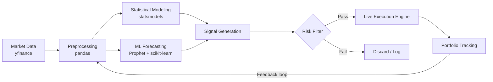
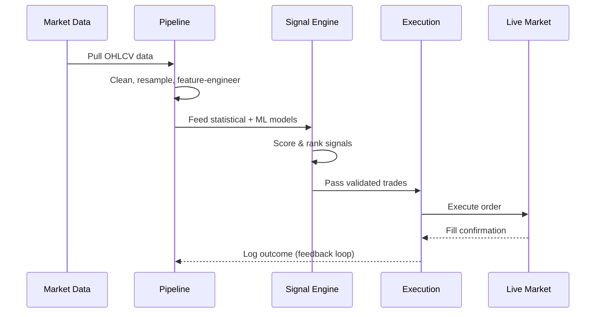
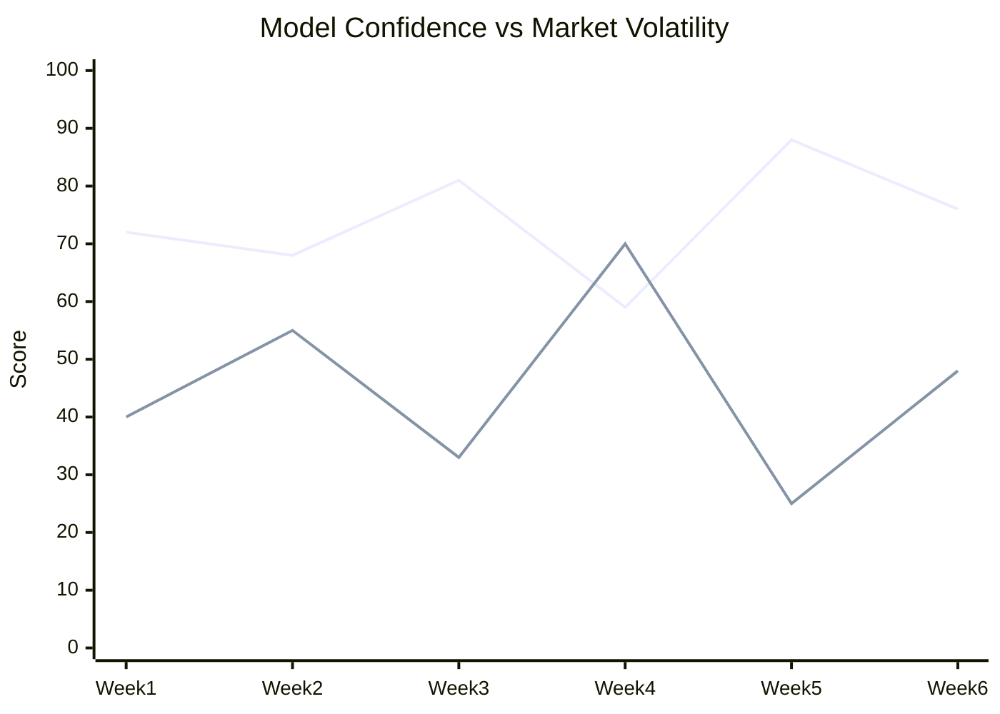

# 📈 Quantitative Stock Analysis Engine

**An end-to-end algorithmic trading pipeline — from raw market data to live execution.**

This project bridges theoretical predictive mathematics with the mess of real-world market volatility, using a stack built for both statistical rigor and production reliability.


---

## 🧭 Why this exists

Most "stock prediction" projects stop at a Jupyter notebook with a pretty R² score. This one doesn't — it's built as a full pipeline: ingest → model → validate → execute, closing the gap between backtest performance and what actually survives contact with a live order book.

---

## 🔩 Architecture



---

## 🔁 Strategy Lifecycle



---

## 🧠 Core Components

| Layer | Tools | Purpose |
|---|---|---|
| **Data Ingestion** | `yfinance`, `pandas` | Pull and clean historical/live OHLCV data |
| **Statistical Modeling** | `statsmodels` | ARIMA/regression-based trend and volatility analysis |
| **ML Forecasting** | `Prophet`, `scikit-learn` | Time-series forecasting + feature-based classification |
| **Execution** | Custom engine | Translates signals into live market orders |
| **Risk Management** | Rule-based filters | Position sizing, drawdown limits, signal confidence thresholds |

---

## 📊 Example: Signal Confidence Over Time



---

## ⚙️ Quick Start

```bash
git clone <your-repo-url>
cd quant-stock-analysis
pip install -r requirements.txt
python main.py --ticker AAPL --mode backtest
```

---

## 🚧 Roadmap

- [ ] Add walk-forward validation to reduce lookahead bias
- [ ] Expand to multi-asset portfolio optimization
- [ ] Integrate a broker API for fully automated live execution
- [ ] Add Sharpe/Sortino-based strategy scoring dashboard

---

## ⚠️ Disclaimer

This project is for educational and research purposes. Nothing here constitutes financial advice — markets are undefeated.
